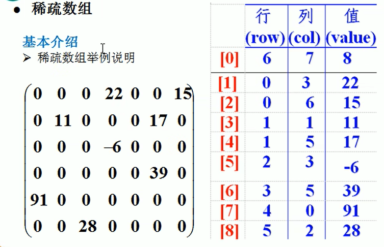

# 数据结构

1. 线性结构：数组、队列、链表、栈
2. 非线性结构：二维数组、多维数组、广义表、**树**、**图**

## 稀疏数组

- 基本介绍：当一个数组中大部分元素为0，或者为同一个值时，可以使用稀疏数组来保存该数组。
- 稀疏数组的处理方法：
  1. 记录数组一共有几行几列，有多少个不同的值
  2. 把具有不同值的元素的行列及值记录在一个小规模的数组中，从而缩小程序的规模
  

## 队列(Queue)

- 基本介绍：
  1. 队列是一个有序列表，可以用数组或者链表实现
  2. 遵循**先入先出**的原则。即先入队列的数据要先取出，后存入的要后取出。

## 链表(Linked List)

- 链表是有序地列表，以节点方式存储，每个节点包含数据以及下一个节点的地址。特点：不连续存储
- 链表分为带头节点的和不带头节点

## 树(Tree)

### 为什么需要树这种结构

1. 数组存储方式的分析  
    优点：通过下标方式访问元素，速度快。**对于有序数组**，还可以使用二分查找提高检索速度。  
    缺点：如果要检索具体某个值，或者插入值(按一定顺序)会整体移动，效率较低。
2. 链式存储方式的分析
    优点：在一定程度上对数组存储方式有优化，比如：插入一个数值节点，只需要将该节点链接到  
    链表中即可，删除效率也很好。
    缺点：在进行检索时，效率任然比较低，比如检索某个值需要从头节点开始遍历。
3. 树存储方式的分析
    能提高数据存储、读取的效率，比如利用**二叉排序树(Binary Sort Tree)**，既可以保证  
    数据的检索速度，同时也可以保证数据的插入，删除，修改的速度。

### 二叉树

遍历方式：
    前序：父、左、右。中序：左、父、右。后序：左、右、父